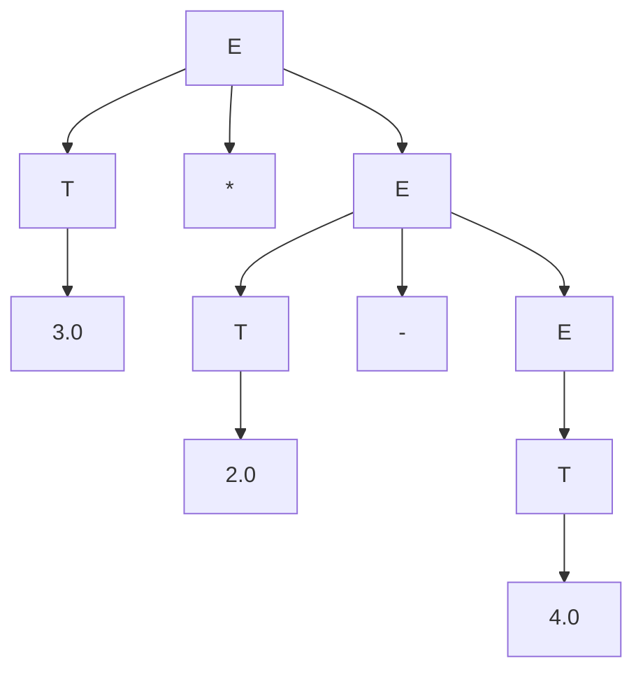
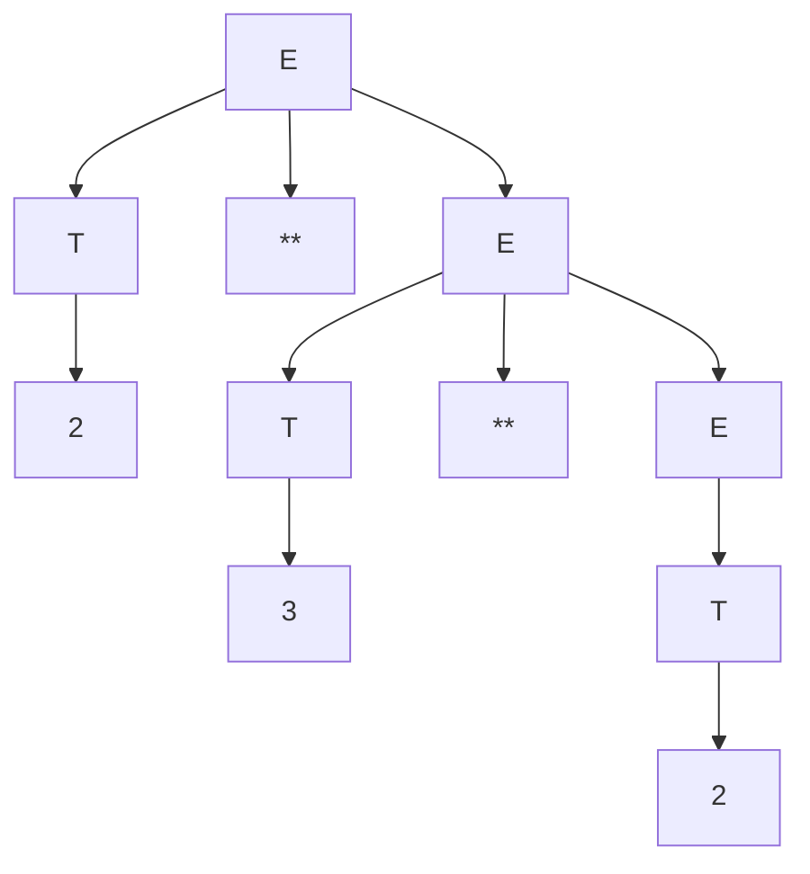

# Syntax Directed Translation with Jison

Jison is a tool that receives as input a Syntax Directed Translation and produces as output a JavaScript parser  that executes
the semantic actions in a bottom up ortraversing of the parse tree.
 

## Compile the grammar to a parser

See file [grammar.jison](./src/grammar.jison) for the grammar specification. To compile it to a parser, run the following command in the terminal:
``` 
➜  jison git:(main) ✗ npx jison grammar.jison -o parser.js
```

## Use the parser

After compiling the grammar to a parser, you can use it in your JavaScript code. For example, you can run the following code in a Node.js environment:

```
➜  jison git:(main) ✗ node                                
Welcome to Node.js v25.6.0.
Type ".help" for more information.
> p = require("./parser.js")
{
  parser: { yy: {} },
  Parser: [Function: Parser],
  parse: [Function (anonymous)],
  main: [Function: commonjsMain]
}
> p.parse("2*3")
6
```
# 3.1 Diferencia entre /* skip whitespace */ y devolver un token.

La acción de lexer toma los caracteres y no devuelve ningún token, para devolver un token estaría "return 'NUMBER';" que produce un token que envía al parser.

# 3.2. Escriba la secuencia exacta de tokens producidos para la entrada 123**45+@.

Secuencia de tokens (en orden), mostrando token y yytext:

NUMBER (yytext = "123")
OP (yytext = "**")
NUMBER (yytext = "45")
OP (yytext = "+")
INVALID(yytext = "@")
EOF (yytext = "")

# 3.3. Indique por qué ** debe aparecer antes que [-+*/].

Debido a que es un operador de dos caracteres y el lexer debe reconocerlo como un único token OP. Ya que jison buscaría emparejar las reglas en orden.

# 3.4. Explique cuándo se devuelve EOF
Se devuelve EOF debido a que se termina de leer el final de la linea, para saber cuando se ha terminado de leer tokens.

# 3.5. Explique por qué existe la regla . que devuelve INVALID.

Debido a que la regla "." toma cualquier caracter que no haya sido "match" de alguno de los anteriores. Y devuelve "INVALID" para que ese carácter se consuma y se entregue al parser.

Aquí tienes el contenido listo para copiar y pegar en un archivo `README.md`. He estructurado las derivaciones, los árboles en formato **Mermaid** y la explicación semántica siguiendo la gramática de asociatividad por la izquierda (sin precedencia de operadores).

---

# Análisis de Expresiones Gramaticales

## 1. Definición de la Gramática
La gramática utilizada para este ejercicio es:
1. $E \to E + T$
2. $E \to E - T$
3. $E \to E * T$
4. $E \to E / T$
5. $E \to E ** T$
6. $E \to T$
7. $T \to \text{num}$

---

## 1.1. Derivaciones
Debido a la recursividad por la izquierda, la derivación se realiza expandiendo el símbolo más a la derecha primero (o viendo la estructura de atrás hacia adelante).

### Frase A: `4.0 - 2.0 * 3.0`
1. $E \Rightarrow E * T$
2. $E \Rightarrow (E - T) * T$
3. $E \Rightarrow (T - T) * T$
4. $E \Rightarrow (4.0 - 2.0) * 3.0$

### Frase B: `2 ** 3 ** 2`
1. $E \Rightarrow E ** T$
2. $E \Rightarrow (E ** T) ** T$
3. $E \Rightarrow (T ** T) ** T$
4. $E \Rightarrow (2 ** 3) ** 2$

### Frase C: `7 - 4 / 2`
1. $E \Rightarrow E / T$
2. $E \Rightarrow (E - T) / T$
3. $E \Rightarrow (T - T) / T$
4. $E \Rightarrow (7 - 4) / 2$

---

## 1.2. Árboles de Análisis Sintáctico (Mermaid)

### Frase: `4.0 - 2.0 * 3.0`


### Frase: `2 ** 3 ** 2`


### Frase: `7 - 4 / 2`
```mermaid
graph TD
    E1[E] --> E2[E]
    E1 --> OP1[/]
    E1 --> T1[T]
    T1 --> V1[2]
    
    E2 --> E3[E]
    E2 --> OP2[-]
    E2 --> T2[T]
    T2 --> V2[4]
    
    E3 --> T3[T]
    T3 --> V3[7]
```

---

## 1.3. Orden de Evaluación Semántica

Como la gramática es recursiva por la izquierda, el orden de ejecución es el siguiente:

1. **Evaluación de Hojas:** Se obtienen los valores de los tokens numéricos.
2. **Ascenso inicial:** El primer operando de la izquierda sube de `T` a `E`.
3. **Operación Interna:** Se evalúa la operación que esté más profunda en el árbol (la que está más a la izquierda en la frase).
4. **Operación Raíz:** Se evalúa la operación superior (la que está más a la derecha en la frase).

### Resultado de la evaluación según esta gramática:

| Frase | Orden de Operación | Resultado Semántico | Resultado Matemático (Estándar) |
| :--- | :--- | :--- | :--- |
| `4.0 - 2.0 * 3.0` | `(4.0 - 2.0) * 3.0` | **6.0** | -2.0 |
| `2 ** 3 ** 2` | `(2 ** 3) ** 2` | **64** | 512 |
| `7 - 4 / 2` | `(7 - 4) / 2` | **1.5** | 5.0 |